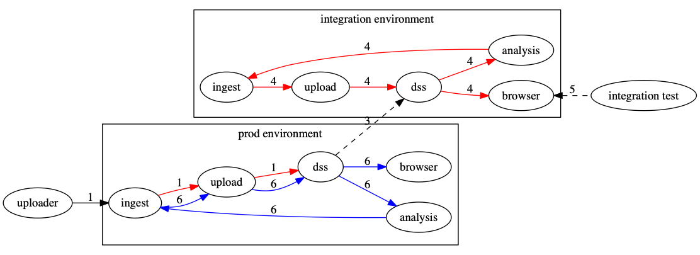

### DCP PR:

# Metadata integration testing

## Summary

This document details an integration test design for metadata schema changes in the Human Cell Atlas (HCA) Data Coordination Platform (DCP).

## Authors

* [Andrey Kislyuk](mailto:akislyuk@chanzuckerberg.com)
* [Sam Pierson](mailto:spierson@chanzuckerberg.com)
* [Matt Weiden](mailto:mweiden@chanzuckerberg.com)
* [Mark Diekhans](mailto:markd@ucsc.edu)
* [Hannes Schmidt](mailto:hannes@ucsc.edu)

## Shepherd

## Motivation

Currently breakages to DCP systems caused by metadata schema changes are detected at runtime upon data (bundle) upload. This forces data wranglers, DCP operators, and data consumers to react to unpredictable runtime failures rather than detecting problems before the code is merged and deployed.

To alleviate this issue, the DCP development team can use a metadata schema integration test to test whether it is safe to release data downstream of the Data Storage Service (DSS), past which point applications start to depend on the schema. The benefits of this approach are that it will:

1. Make the development environment more stable
1. Make updates to software and schema smaller and more frequent
1. Make failures due to metadata schema changes more readily observable
1. Increase availability of DCP systems downstream of DSS

## Detailed Design

In this design we will use the following terms:
 
 * "schema integration test system" - an automated CI/CD pipeline used to check that downstream systems can handle bundles with a new schema
 * "new schema label" - anything that indicates that the schema has changes that have not yet been tested against downstream systems: potentially a JSON field, git tag, git branch, or comparison to tested version list

Design

1. Bundles with new metadata schema changes are uploaded to the production environment with a new schema label
1. Observing the new schema label, the DSS stores the new bundles and makes them available with the `GET /v1/bundles` endpoint with the bundle `uuid` or `(uuid, version)`, but does not index nor does it release subscription notifications for them.
1. Via a schema integration test system, a sample of the uploaded bundles are copied from the production DSS to the integration DSS testing environment.
1. The integration DSS deployment stores the bundles, indexes their metadata, and releases bundle events to downstream systems in the integration environment with subscriptions.
1. The schema integration test checks the results and passes if systems downstream of the integration DSS have correctly processed the new bundles; it fails otherwise.*
1. If the schema integration test passes, the new bundles in the production DSS can be released downstream by issuing a new bundle version of each without the new schema label. This process could be automated.
1. If the schema test does not pass, the data is not released and development teams are notified to resolve the issue and rerun the test.

*Integration test data flow: test path is shown in red, production release in blue, integration tooling in dashed lines; edges are labeled with corresponding step numbers in the design above*

\* To estimate the impact of schema changes on third party applications, the schema integration test system could run critical [data consumer vignettes](https://github.com/HumanCellAtlas/data-consumer-vignettes).

### Pros:

* Bundles only have to be uploaded once
* Bundles can be uploaded directly to the production environment
* Tests exactly what bundles downstream systems will see; does not require complicated fake metadata generation code in tests
* Data in storage is immediately available after upload via the `GET /v1/bundles` endpoint
* Downstream systems are protected from new schema changes until it can be confirmed that they are able to handle the changes
* Does not require replaying subscription notifications

### Cons:

* Does not test new bundles against the ingestion pipeline, this is assumed to "just work"
* Does not cover third party systems, which may be consuming from the DSS
* New bundles are not available in the data browser until tests for the entire system have passed
* There is no hard guarantee that downstream production systems will be able to handle new bundles: there could be critical updates in the integration environment which have not yet reached production
* In the case that the integration test does not pass, developers and wranglers will have to exercise care in propagating fixes to production before releasing the new bundles downstream of the production DSS

## Discussion:

It would be highly desirable to make metadata available to components based on the individual component tests passing, as opposed to all of the test.  In particular, viability in the data browser before secondary analysis application can process the data would address the needs to make the primary data available as quickly as possible.

Using the major version number of the last passing test for a component could work as a filter.  However, the push notification model of the DSS makes implementing this a complex undertaking.  It is suggested that supporting a more granular data visibility model be considered based on the experiences with the above implementation.

The proposed approaches to decoupling metadata changes from the application 
[Sustainable Development Over Metadata](https://docs.google.com/document/d/1KpgPXqqnWCDqXDHMr1whmmCaT8XC2F7ddrDc0RPnyt4/edit?ts=5b9ac30c#heading=h.irkib9r22q8v) may limit the test failures and make a more granular approach unnecessary.